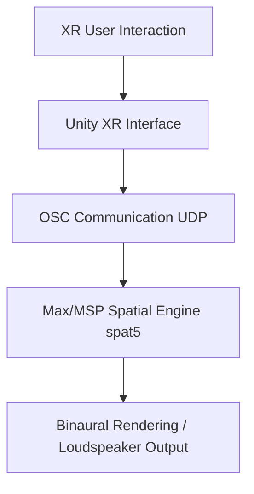

# 3D Spatial Audio Interaction Toolkit

## Overview

This project investigates a **human-centered 3D user interface for spatial audio design** in immersive environments.

A Unity XR application enables users to interact with spatial audio scenes by:

- positioning virtual loudspeakers in 3D space
- controlling gain, equalization, and reverberation parameters
- navigating audio design workflows through an intuitive hand-menu interface

The Unity interface communicates in real time with a **Max/MSP spatial audio engine (spat5)** using **Open Sound Control (OSC)**.

This system aims to support research in:

- spatial cognition in XR
- usability of 3D audio interfaces
- immersive sound design workflows
- integration of game engines with professional DSP environments

This prototype is developed as part of a **Bachelor Thesis** at HTW Berlin.

---

## System Architecture

## Core Components

### Unity XR Application
- Hand-menu UI system
- Speaker grabbing and positioning
- Gain, EQ and Reverb controls
- Listener tracking (position + rotation)
- Scene serialization (Save / Load)
- OSC communication layer

### Max/MSP Spatial Audio Engine
- Spatialization using spat5
- Parametric EQ processing
- Reverb processing
- Audio rendering and monitoring

## Documentation Structure

### System
- [System Architecture](01_System_Architecture.md)
- [OSC Protocol Specification](02_OSC_Protocol.md)

### Interaction & Interface
- [XR Interaction Design](03_XR_Interaction.md)
- [Speaker System](04_Speaker_System.md)

### Audio Processing
- [Equalizer System](05_EQ_System.md)
- [Reverb System](06_Reverb_System.md)

### Data & Evaluation
- [Save / Load System](07_Save_Load.md)
- [Evaluation Methodology](08_Evaluation.md)

### Setup & Development Log
- [Setup Guide](setup-guide.md)
- [Development Log](10_Development_Log.md)

## Repository Structure
- **Assets/** — Unity project assets
- **Packages/** — Unity package dependencies
- **ProjectSettings/** — Unity configuration
- **Docs/** — Technical documentation

## Author

**Theofanis Gkioles Blatsoukas**

Bachelor Thesis  
Informatik in Kultur und Gesundheit  
HTW Berlin  