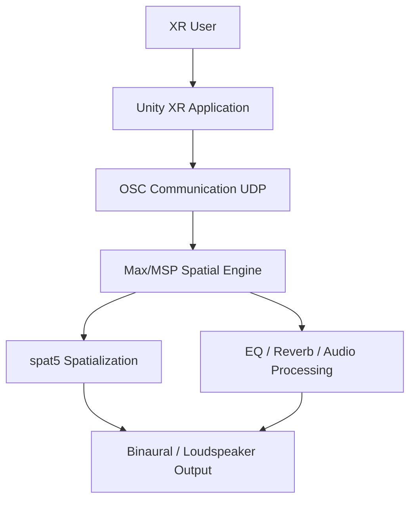

# System Architecture

## Overview

The system is based on a **distributed architecture** in which the user interface and interaction logic are implemented in **Unity**, while the audio processing and spatialization are implemented in **Max/MSP**.

Communication between both environments is achieved via **Open Sound Control (OSC)** over UDP.  
This separation allows Unity to function as a flexible 3D/XR interaction layer, while Max/MSP provides a powerful and modular DSP environment for spatial audio processing.

---

## Architectural Principle

The project follows a **front-end / back-end model**:

- **Unity** acts as the **interaction and visualization front-end**
- **Max/MSP** acts as the **audio processing back-end**

This design was chosen for the following reasons:

- Unity provides strong support for XR interaction, 3D visualization, and scene management
- Max/MSP enables rapid prototyping of audio DSP processes
- OSC provides a lightweight and well-established protocol for real-time communication between multimedia systems
- The separation of concerns improves modularity and extensibility

---

## High-Level Architecture

## Main Components

### 1. Unity XR Application

Unity is responsible for all interaction, visualization, and scene-level logic.

#### Responsibilities

- Rendering the 3D environment
- Displaying and managing the hand-menu user interface
- Handling XR interaction
- Representing virtual speakers in the scene
- Tracking listener position and orientation
- Managing UI parameters such as gain, EQ, and reverb
- Saving and loading application states
- Sending and receiving OSC messages

#### Main Subsystems

##### XR Interaction Layer

Handles controller or hand-based interaction with:

- Speakers
- Sliders
- Menu buttons
- 3D scene elements

##### UI Layer

Implements the hand-menu structure including:

- Home page
- Save / Load page
- Filter page
- Position page

##### Scene Objects

Represents:

- Virtual speakers
- Listener / user position
- Visual spatial configuration

##### OSC Communication Layer

Uses **extOSC** in Unity to:

- Transmit spatial and parameter data to Max/MSP
- Receive parameter updates from Max/MSP

##### Serialization Layer

Stores and restores system state including:

- Speaker IDs
- Speaker positions
- Gain values
- EQ values
- Reverb values

---

### 2. Max/MSP Audio Engine

Max/MSP is responsible for the audio processing side of the system.

#### Responsibilities

- Receiving OSC messages from Unity
- Routing incoming control data
- Performing spatialization via **spat5**
- Processing EQ and reverb parameters
- Rendering the resulting audio output
- Optionally sending values back to Unity for synchronization

#### Main Subsystems

##### OSC Input / Output

Implements bidirectional OSC communication using:

- `udpreceive`
- `udpsend`
- `OSC-route (CNMAT)`

##### Spatialization Engine

Uses **spat5** for:

- Source positioning
- Listener tracking
- 3D spatial rendering
- Visualization of listener/source locations

##### Equalizer Processing

Receives EQ band values from Unity and routes them to:

- `filtergraph~`
- Associated filtering logic

##### Reverb Processing

Receives reverb control values from Unity and maps them to:

- Reverb parameter controls
- Associated DSP modules

##### Audio Output

Outputs:

- Binaural headphone monitoring
- Loudspeaker-based rendering

---

## Communication Model

The system uses **OSC over UDP** as the communication protocol between Unity and Max/MSP.

### Port Configuration

| Direction     | Description                                      | Port |
|--------------|--------------------------------------------------|------|
| Unity → Max  | Control data (gain, EQ, reverb, position)        | 6161 |
| Max → Unity  | Parameter feedback / synchronization             | 9001 |

### Typical Message Types

#### Listener
- `/listener/xyz`
- `/listener/ypr`

#### Speakers
- `/source/{id}/xyz`
- `/vol{id}`

#### Equalizer
- `/filter/{band}`

#### Reverb
- `/reverb/{param}`

The exact OSC protocol is documented in the **OSC Protocol Specification** page.

---

## Data Flow

The following steps describe the normal interaction flow:

1. The user interacts with the Unity XR application.
2. Unity updates the UI state or scene objects.
3. Unity sends the corresponding OSC messages to Max/MSP.
4. Max/MSP routes the incoming messages.
5. Audio parameters or spatial source positions are updated.
6. The processed audio is rendered.
7. Optionally, Max/MSP sends updated values back to Unity to synchronize interface elements.

---

## Interaction Flow Example

### Example: Moving a Speaker in Unity

1. The user grabs a virtual speaker object in XR.
2. Unity updates the speaker transform in the 3D scene.
3. Unity sends the new position via OSC to Max/MSP.
4. Max/MSP receives the updated `/source/{id}/xyz` message.
5. The spatial position of the source is updated in the **spat5** environment.
6. Audio rendering reflects the new source position.

### Example: Changing an EQ Band

1. The user moves an EQ slider in Unity.
2. Unity sends a `/filter/{band}` OSC message containing frequency and gain.
3. Max/MSP routes the band message using **OSC-route**.
4. The corresponding filter is updated in `filtergraph~`.
5. The new EQ response is applied to the audio signal.

---

## Architectural Benefits

This architecture provides several benefits.

### Separation of Concerns

Unity and Max/MSP each focus on what they do best:

- **Unity:** interaction and visualization
- **Max/MSP:** audio processing and DSP

### Modularity

Subsystems can be developed and tested independently:

- UI can evolve without changing DSP logic
- Audio processing can be modified without changing the 3D interface

### Extensibility

The OSC-based structure makes it easy to:

- Add more parameters
- Integrate more speaker objects
- Extend the save/load system
- Replace or expand the DSP backend

### Research Suitability

The architecture is especially useful for academic prototyping because:

- Interaction and sound processing can be iterated quickly
- Components can be documented independently
- Usability and technical performance can be evaluated separately

---

## Current Limitations

The architecture also introduces some constraints:

- The system depends on stable OSC communication over the network
- Unity and Max/MSP must remain synchronized
- Network configuration must be correct when using standalone XR devices
- OSC parameter routing must be carefully maintained for large-scale expansion

These limitations are acceptable within the scope of a prototype and research environment.

---

## Summary

The project architecture combines the strengths of **Unity XR** and **Max/MSP** in a modular distributed system.

**Unity handles:**

- Interaction
- Scene visualization
- XR interface logic
- Serialization
- OSC transmission

**Max/MSP handles:**

- Spatialization
- EQ
- Reverb
- Audio rendering

This structure enables flexible experimentation with immersive spatial audio interfaces while maintaining a clear separation between interaction design and audio processing.

---

## Related Pages

- [Home](index.md)
- [OSC Protocol Specification](osc-protocol-specification.md)
- [XR Interaction Design](xr-interaction-design.md)
- [Speaker System](speaker-system.md)
- [Equalizer System](equalizer-system.md)
- [Reverb System](reverb-system.md)
- [Save / Load System](save-load-system.md)
- [Setup Guide](setup-guide.md)  