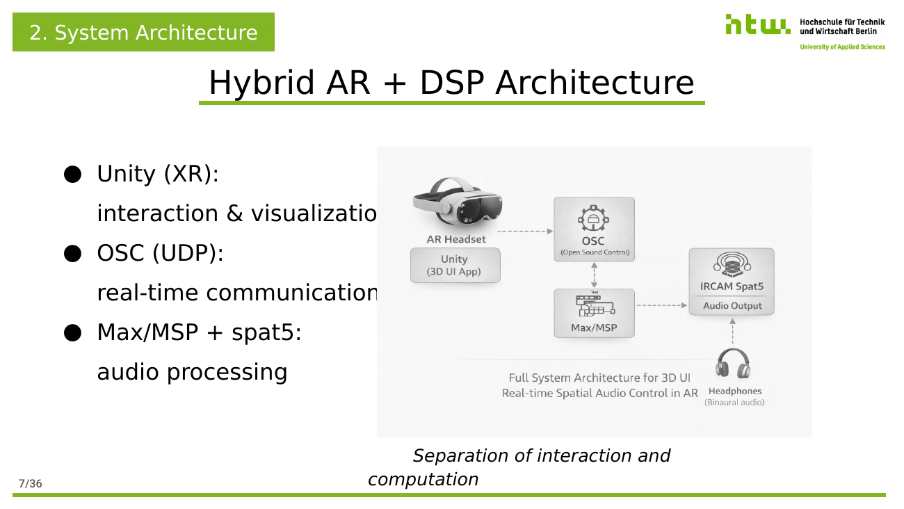

# A 3D User Interface for Real-Time Spatial Audio Control

> Bachelor thesis project — HTW Berlin, *Informatik in Kultur und Gesundheit* (2025).
> Supervisors: Prof. Dr.-Ing. Johann Habakuk Israel, Sebastian Keppler.

A hybrid AR + DSP system that lets a user shape a spatial audio scene in real time, in 3D, from inside the scene. A Unity XR application on Oculus Quest 3 (passthrough AR) provides the interaction layer; a Max/MSP patch with IRCAM **spat5** provides the audio engine; the two communicate over **OSC** in real time.

The thesis investigates whether moving spatial audio control out of 2D DAW interfaces and into an embodied 3D UI makes spatial sound design more intuitive without compromising audio quality.

---

## Why this exists

Spatial audio is fundamentally three-dimensional, but the tools to shape it are not — they sit inside 2D DAWs and assume the user has expert DSP knowledge. This project explores whether immersive AR can close that gap: a head-tracked, body-anchored UI for placing sources, shaping their tone, and walking through the scene while it sounds, with binaural rendering live in the headphones.

The system was evaluated through a small qualitative user study (n=4) and produced a working hybrid AR–DSP prototype with a novel coordinate-transformation contribution (see *Key technical contribution* below).

---

## System architecture



Three components, cleanly separated:

- **Unity (XR)** — interaction and visualization on Oculus Quest 3, passthrough AR.
- **OSC over UDP** — real-time control transport between Unity and Max/MSP.
- **Max/MSP + IRCAM spat5** — audio effects, spatialization, and HRTF-based binaural rendering.

The separation between *interaction* and *computation* is intentional: Unity handles only what needs the headset; the DSP runs on a host PC where Max/MSP is at home. The OSC link is the only contract between them.

---

## AR interaction design


Built with Unity's XR Interaction Toolkit on Oculus Quest 3 (passthrough AR).

- **Interaction**: ray-based pointing + trigger grab for translational and rotational manipulation of virtual speakers.
- **Body-anchored UI**: control panel rigidly attached to the left controller, which solved the floating-panel problem identified in pilot testing.
- **Tabs**: Home / Save-Load / FX / Speaker Position.
- **Visual feedback**: hover and selection highlighting to reduce accidental manipulation.

---

## OSC communication


The control link uses hierarchical OSC addressing and a dual transmission policy:

- **Spatial data** (positions, rotations) — sent continuously while interaction is active.
- **Parameters** (EQ bands, reverb, source enable) — sent on change, not periodically.

Example addresses:

```
/source/3/xyz       1.20 0.85 -2.10
/filter/2/gain      -3.5
/reverb/1/decay     1.8
```

This split keeps the control bandwidth tight without sacrificing the perceptual continuity of position updates.

---

## Audio engine: Max/MSP + IRCAM spat5


Signal chain inside Max/MSP:

```
Audio Source  →  Audio Effects  →  Spatialization  →  Binaural Output
```

- **6-band parametric EQ** — `cascade~` + `filtergraph~`.
- **Reverb** — size, decay time, high-frequency damping, diffusion.
- **Binaural rendering** — HRTF-based, using IRCAM spat5's HRTF database, so the perceived 3D position works over standard headphones.

---

## Key technical contribution: inverse source transformation


The engineering-defining moment of the thesis. Two problems collided:

1. **spat5 assumes a fixed listener position.** It is built around the model where sources move around a stationary head, which is the wrong assumption when the user is walking around inside the scene with a headset on.
2. **Unity and spat5 use different coordinate systems.** Y-up versus Z-up, left-handed versus right-handed, with axes swapped.

The solution is an **inverse source transformation** layer between Unity and spat5:

- User moves forward → all sources move backward by the same amount.
- User rotates → all sources rotate inversely around the listener.
- A coordinate-mapping matrix translates Unity space into spat5 space at every update.

The result: spat5 still believes the listener is fixed, but the user experiences full head-tracked spatial audio that responds to walking and rotating in the room.

---

## Save / load — session persistence


Runtime state is captured to a serializable data model (POCO / data class via `JsonUtility`) and written to JSON on disk via `Application.persistentDataPath`. On load, the JSON is parsed, speaker objects are respawned, transforms and parameters are reapplied, and the UI reflects the restored session.

Stored fields:

- Speaker positions and rotations.
- 6-band EQ bands (frequency + gain per band).
- Reverb and delay parameters.

---

## Evaluation

Small qualitative user study, n = 4 participants, 20–30 minute sessions on the full hardware setup (Quest 3 + headphones + host PC running Max/MSP). Tasks: speaker positioning, EQ adjustment, spatial exploration.

Headline findings:

- **Spatial interaction** read as intuitive across all participants.
- **Audio feedback** was essential — silent positioning felt disconnected.
- **Cognitive load** was high but manageable for participants with prior spatial audio experience.
- **Satisfaction** was positive overall.

---

## Limitations (honest)

- Small evaluation sample (n=4) — qualitative signal only, not a controlled study.
- **The inverse listener model is a workaround**, not a primitive. Native moving-listener support in spat5 would eliminate the ambiguity at extreme distances or rotations.
- The full hardware footprint (Quest 3 + host PC + headphones) makes the system best suited for rehearsal/studio use rather than performance.
- No live audio output representation in Unity — the user hears the spat5 output via headphones but the Unity side has no visual indicator of audio activity.

---

## Future work

- Unity-side audio output representation (visual feedback for audio activity in the scene).
- Native moving-listener support in spat5, eliminating the inverse-transform workaround.
- Individualized HRTFs for better elevation perception.
- Hand tracking instead of controller-based interaction.
- A larger, controlled user study with quantitative performance benchmarks.

---

## Stack

| Layer | Tech |
|---|---|
| XR runtime | Unity 2022.x, XR Interaction Toolkit, OpenXR |
| Hardware | Oculus Quest 3 (passthrough AR), wired headphones, host PC |
| Transport | OSC over UDP (Quest 3 ↔ host PC over Wi-Fi) |
| DSP | Max/MSP, IRCAM spat5, `cascade~`, `filtergraph~` |
| Persistence | JSON via Unity `JsonUtility`, `Application.persistentDataPath` |

---

## Repository contents

```
.
├── docs/
│   └── images/             — architecture and interaction diagrams (this README)
├── unity/                  — Unity XR project (to add)
├── max/                    — Max/MSP patches with spat5 (to add)
└── README.md
```

> **Status**: Documentation and diagrams are public. The Unity project and Max patches are not yet published here — see the *About sharing the code* section below.

---

## About sharing the code

This is an academic thesis project. The Unity scripts and Max/MSP patches will be added incrementally, with third-party assets (IRCAM spat5 itself, paid Unity packages) excluded for licensing reasons.

For a live demonstration video or to discuss the implementation in detail, please get in touch — links below.

---

## Author

**Fanis Gioles** — Berlin
[fanisgioles.com](https://www.fanisgioles.com) · [LinkedIn](https://linkedin.com/in/fanis-gioles) · fanis.gioles@gmail.com

Created at HTW Berlin, 2025. Supervisors: Prof. Dr.-Ing. Johann Habakuk Israel, Sebastian Keppler.
